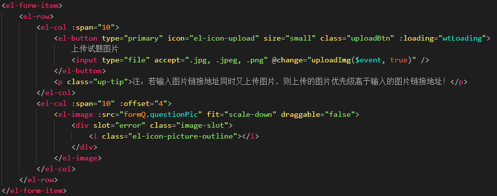
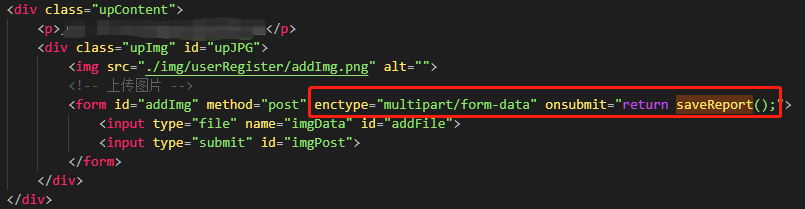

# 图片上传「文件流形式」

### 业务需求：

-   文件上传在项目开发过程中是必不可少的一项功能。目前大多数文件上传都是采用文件流的形式进行上传。随着技术的进步，云服务技术的产生，现在上传文件相比原来更迅速、更方便，对上传文件的管理较之前来说方便了许多；
-   为兼顾原有的项目，上传文件没有采用现在使用比较多的阿里云 oss 文件直传，而是采用的后台辅助存储上传的形式来进行文件的存储。相对来说，文件上传比较慢，等待时间有点长。获取文件不像 oss 直传那样返回一个绝对的地址链接，而是返回的一个文件的 key，通过指定的参数拼接来换取图片地址；
-   此次简称为‘文件流上传’，前期开发的时候出现了一些错误，现将原有的文件流上传文件的具体实现步骤做相应分析处理，以便日后开发过程中使用。

### 效果图：

:::info 效果图


-   **注**：图片上传成功后，会在右侧灰色图片区域内进行展示。

:::

### 布局代码一：

:::info 代码案例


-   **基于【 Vue 】**
-   采用**elementUI**的**el-input**标签与**input**文件上传标签相结合的方式；
-   **wtLoading**为 UI 框架的**el-button**按钮**loading**加载状态。

:::

### 样式代码：

```css title="CSS 样式"
// 上传按钮样式布局
.uploadBtn {
	display: block;
	height: 100%;
	width: 100%;
	position: relative;
	overflow: hidden;
}

.uploadBtn > input[type="file"] {
	width: 100%;
	opacity: 0;
	cursor: pointer;
	position: absolute;
	top: 0;
	right: 0;
	bottom: 0;
	left: 0;
}
```

### 实现代码【 vue 】：

```javascript title="实现代码"
// 方式一：基于vue
uploadImg(file) {
	// 采用formData格式
	let fd = new FormData();
	fd.append("imgData", file);
	this.$axios
		.post("图片上传api", fd)
		.then(res => {
			let data = res.data;
			if (data.code == "1") {
				// 返回生成的图片ID
				this.imgGid = data.imgGid;
				// 拼接图片Id，获取绝对地址
				this.imageUrl = this.pic + data.imgGid;
				console.log('上传成功！')
			} else {
				console.log('上传失败！')
			}
		});
}
```

### 布局代码二：

:::info 布局代码


-   **基于【 JavaScript 】**
-   借助 **jQuery** 的 **form 表单** 提交实现二进制流文件上传；
-   上传的过程中会动态加载一张 loading.gif 动态图，当图片上传完成或者上传失败时候移除 loading 图。

:::

### 实现代码【 JavaScript 】：

```javascript title="实现代码"
const saveReport = function () {
	/* jQuery.form表单提交数据 */
	$("#addImg").ajaxSubmit({
		type: "post",
		url: "上传接口api",
		data: {
			picType: "jpg" // 图片格式
		},
		dataType: "json",
		success: function (res) {
			if (res.code == 1) {
				/* 生成的图片ID */
				avatars = res.imgGid;
				/* 拼接回显图片 */
				$("#upJPG").prepend('');
				/* 删除图片 */
				$(".close").on("click", function (e) {
					/* 阻止图片跳转 */
					e.stopPropagation();
					/* 对dom的操作 */
				});
			}
		},
		error: function (err) {
			hintCard("网络错误");
		}
	});
	/* 防止表单自己再次提交，并跳转页面 */
	return false;
};
```
