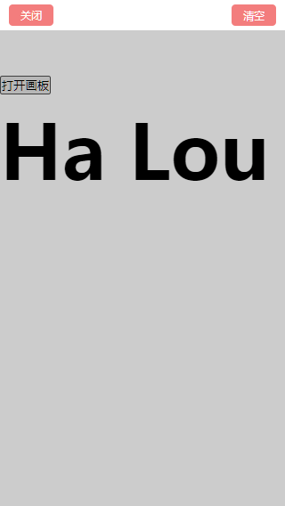
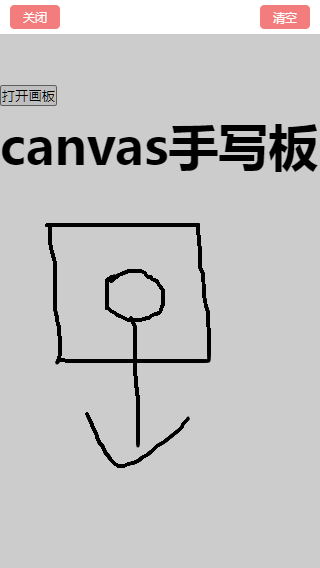

# Canvas 签字板

#### 场景需求：

需要开发一个移动端的手写板，要求是类似于签字版，于是就想到了使用 canvas 着手做一个满足业务需求。

本次实现的 canvas 签字版主要用于手机端网页，若用于 PC 端网页请自行对事件函数以及相应代码做对应的修改。

#### 效果图：

-   效果图-1
    
-   效果图-2
    

#### 实现代码：

```css title="基础样式"
* {
	margin: 0;
	padding: 0;
}

html {
	overflow: hidden;
	overflow-y: auto;
}

#app {
	width: 100vw;
	height: 100vh;
	background-color: #ffffff;
}

/* 白板style */
div.bb-center {
	width: 100vw;
	height: 100vh;
	top: 0;
	bottom: 0;
	position: fixed;
	background-color: rgba(0, 0, 0, 0.2);
	z-index: 10;
	font-size: 0.3rem;
	visibility: hidden;
}

/* 显示画板 */
div.bb-center.active {
	visibility: visible;
}

.bbc-top {
	box-sizing: border-box;
	height: 0.8rem;
	padding: 0.1rem 0.24rem;
	width: 100%;
	background-color: #fff;
	display: flex;
	justify-content: space-between;
	align-items: center;
}

.bbc-top > div {
	padding: 0.1rem 0.3rem;
	font-size: 0.28rem;
	color: #ffffff;
	background: rgba(243, 125, 125, 1);
	border-radius: 0.1rem;
}

.bbc-view {
	width: 100vw;
	height: calc(100vh - 0.8rem);
}

.bbc-view > canvas {
	width: 100%;
	height: 100%;
}
```

**注**：**html** 页面布局使用的 **rem 布局**，根字体大小是 **50px**。

```html title="页面布局"
<html>
	<head></head>
	<body>
		<div id="app">
			<div class="bb-center" :class="{active:isShow}">
				<div class="bbc-top">
					<div @click="closeBB">关闭</div>
					<div @click="clearBB">清空</div>
				</div>
				<div class="bbc-view" ref="bbcView">
					<canvas
						ref="canvas"
						:width="cvsWidth"
						:height="cvsHeight"
						@touchstart="onTouchStart"
						@touchmove="onTouchMove"
						@touchend="onTouchEnd"
					></canvas>
				</div>
			</div>
			<!-- 内容区 -->
			<div class="wrap">
				<button type="button" @click="openBB">打开画板</button>
				<h3>canvas手写板</h3>
			</div>
		</div>
	</body>
</html>
```

```javascript title="逻辑代码"
const vm = new Vue({
	el: "#app",
	data: {
		cvsWidth: 0,
		cvsHeight: 0,
		isShow: false,
		ctx: "" // canvas对象
	},
	mounted() {
		this.initCanvas();
	},
	methods: {
		// 初始化canvas
		initCanvas() {
			let bbcView = this.$refs.bbcView;
			// 设置canvas的宽度和高度
			this.cvsWidth = bbcView.offsetWidth;
			this.cvsHeight = bbcView.offsetHeight;

			let $cvs = this.$refs.canvas;
			if (!$cvs.getContext) return;
			// canvas基础设置
			this.ctx = $cvs.getContext("2d");
			this.ctx.beginPath();
		},
		// 画布的触摸移动开始手势响应
		onTouchStart(e) {
			let offsetLeft = e.target.offsetLeft; // 获取canvas距离页面左边的距离
			let offsetTop = e.target.offsetTop; // 获取canvas距离页面顶部的距离
			let targetX = e.touches[0].clientX - offsetLeft;
			let targetY = e.touches[0].clientY - offsetTop;
			this.ctx.beginPath();
			this.ctx.strokeStyle = "#000"; // 设置线条颜色
			this.ctx.lineWidth = 3; // 设置线条的宽度
			this.ctx.lineCap = "round"; // 设置线条的端点的样式，设为圆弧形
			this.ctx.lineJoin = "round"; // 设置线条的连接点的样式，设为弧形
			this.handleDraw(targetX, targetY);
		},
		// 画布的触摸移动手势响应
		onTouchMove(e) {
			let offsetLeft = e.target.offsetLeft; // 获取canvas距离页面左边的距离
			let offsetTop = e.target.offsetTop; // 获取canvas距离页面顶部的距离
			let targetX = e.touches[0].clientX - offsetLeft;
			let targetY = e.touches[0].clientY - offsetTop;
			this.handleDraw(targetX, targetY);
		},
		// 画布的触摸移动结束手势响应
		onTouchEnd(e) {},
		// 打开白板
		openBB() {
			this.isShow = true;
			// this.ctx.clearRect(0, 0, this.cvsWidth, this.cvsHeight);
			// // 重新设置canvas画板节点对象，否则绘画会出问题,这里异步操作，否则绘画有误
			// setTimeout(() => {
			// 	this.initCanvas();
			// }, 100);
		},
		// 关闭白板
		closeBB() {
			this.isShow = false;
		},
		// 清空白板
		clearBB() {
			//清除画布
			this.ctx.clearRect(0, 0, this.cvsWidth, this.cvsHeight);
		},

		// 绘制画笔
		handleDraw(targetX, targetY) {
			this.ctx.lineTo(targetX, targetY); // 将笔触移到当前点击点
			this.ctx.stroke();
		}
	}
});
```

:::tip
**注：** 本次使用的是基于 vue 开发的，若使用原生 JavaScript 开发，请自行对比修改。
:::
