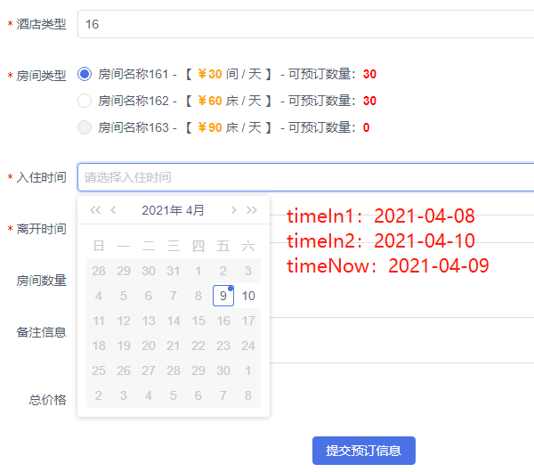
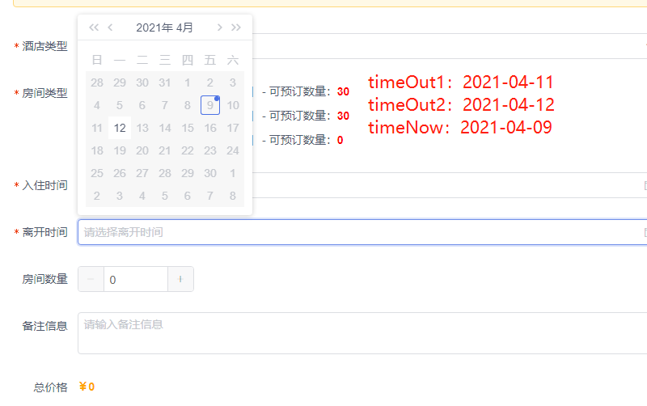

# View UI DatePicker 日期范围限制

## 🍉 场景需求

&emsp;&emsp;近期着手开发酒店住宿相关功能模块，其间涉及到对日期进行相应条件的限制。最初因为公司网络问题，无法访问 ElementUI 网站进行开发，偶然间发现 ViewUI，感觉代码看起来比较简洁，也符合我的选择需求，最后就选择了 ViewUI 进行开发。当初使用它时，还是免费的，现在逐步商业化了，但是需要使用高级功能的话可能就需要付费了，感觉没有 ElementUI 香了。但是没办法，已经上了 🚗 了，再下 👇 就难了。

&emsp;&emsp;此次主要就 ViewUI DatePicker 日期选择器的相关使用技巧做相应的介绍。因为在我的项目中需要指定可选择的日期，故需要对可选日期的范围做相应的限制，现将我所实现的效果做如下展示：

## 🍭 示例展示

-   **【图一】入住时间限制**
    

-   **【图二】离开时间限制**
    

-   **🌞 timeOut1**：离开最早时间
-   **🌜 timeOut2**：离开最晚时间
-   **🌝 timeNow**：当前时间

## 🌱 代码案例

```html title="代码案例"
<template>
	<form :model="bookInfo" :rules="rules" :label-width="80">
		<!-- 住店时间 -->
		<FormItem label="入住时间" prop="checkInTime">
			<DatePicker type="date" :editable="false" :value="bookInfo.checkInTime" :options="optionsIn"></DatePicker>
		</FormItem>
		<!-- 离开时间 -->
		<FormItem label="离开时间" prop="checkOutTime">
			<DatePicker type="date" :editable="false" :value="bookInfo.checkOutTime" :options="optionsOut"></DatePicker>
		</FormItem>
	</form>
</template>
```

:::tip 🍅
HTML 代码，使用 ViewUI DatePicker 组件进行时间选择限制。
:::

```javascript title="代码案例"
import DayJS from "dayjs";

export default {
	name: "CenterBook",
	data() {
		return {
			bookInfo: {
				checkInTime: "" /* 入住时间 */,
				checkOutTime: "" /* 离开时间 */
			},
			/* 时间正则 */
			rules: {
				checkInTime: [{ required: true, message: "请选择入住时间", trigger: "change" }],
				checkOutTime: [{ required: true, message: "请选择离开时间", trigger: "change" }]
			},
			checkInEndTime: "" /* 入住开始时间 */,
			checkInStartTime: "" /* 入住截止时间 */,
			checkOutEndTime: "" /* 离店开始时间 */,
			checkOutStartTime: "" /* 离店截止截止 */,
			optionsIn: {
				disabledDate: date => {
					let tmp1 = this.checkInStartTime,
						tmp2 = this.checkInEndTime;
					if (DayJS(tmp1).valueOf() < Date.now()) {
						return date < DayJS().subtract(1, "day") || date > new Date(tmp2);
					}
					return date < DayJS(tmp1) || date > new Date(tmp2);
				}
			} /* 入住时间限制 */,
			optionsOut: {
				disabledDate: date => {
					let tmp1 = this.checkOutStartTime,
						tmp2 = this.checkOutEndTime;
					if (DayJS(tmp1).valueOf() > Date.now()) {
						return date < DayJS(tmp1) || date > new Date(tmp2);
					}
					return date < DayJS().subtract(1, "day") || date > new Date(tmp2);
				}
			} /* 离开时间限制 */
		};
	}
};
```

:::info 总结

-   对日期选择进行动态限制，**options** 参数接收一个含有指定参数 **disabledDate** 的对象，对要选择的日期进行相关限制处理；

-   **disabledDate** 接收一个 date 参数，返回一个 bolearn 类型的布尔值，即限制不可选的日期。

-   借助 [**Dayjs**](https://dayjs.fenxianglu.cn/category/) 来处理时间数据，相对来说，功能 API 都比较丰富，建议学习一下。

:::
