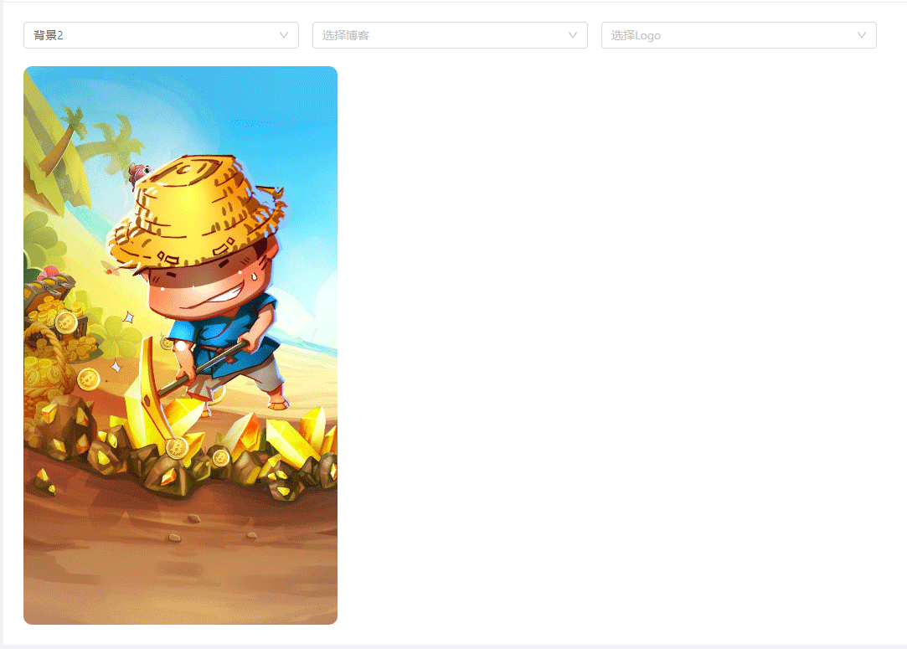
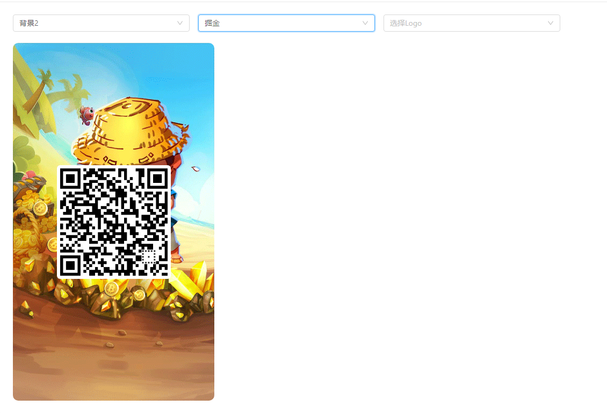
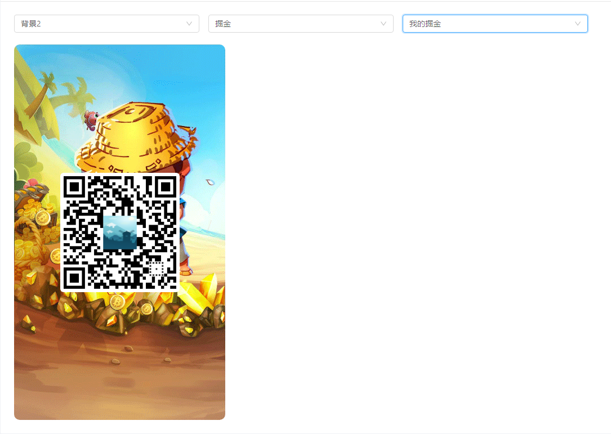

# JS 生成分享带图二维码

### 前言：

&emsp;&emsp;之前在做微信分享时，大多都是基于微信公众号开发实现的微信自定义分享，但是这中分享只能在微信好友或者朋友圈等之间分享，分享的形式大多是“微信小卡片”的形式分享给好友或者分享到朋友圈。但是，还有一些其它情况，比如在公众号中推送公众号文章进行促销，阅读者可以通过公众号文章来引流跳转至已经开发好的 H5 页面。实现此功能，前期需要好多操作，相对来说操作也比较频繁，有时候还需要反复修改生成图片等。最最主要的是还需要负责营销推广的“运营”同事来给开发要 H5 文件链接生成二维码，再发送给编辑人员插入到公众号中进行推广，相对来说，费时费力，还容易出现错误。

&emsp;&emsp;偶然间看到一公众号内嵌的 H5 网页有一个分享按钮，最初以为是用“微信小卡片”的形式分享给好友，但是当我点击分享后，不是分享给好友，而是生成了一张带有自己信息的图片，此处提示“长按并保存图片到手机”，感觉这种分享方式还挺特别的。再做营销类的活动时，需要好友“助力”，这种活动前期比较多，自从“PDD”疯狂邀请好友助力的模式出现之后，也引起了微信用户的反感。现在微信管理的比较严格了，类似这种助力方式也少了很多，但是现在推广活动中，偶尔还是会用到的，毕竟“产品大佬”方法和点子还是比较多的，做为开发的我们也只能想办法去实现喽！

**接下来主要讲的是借助第三方插件来实现组合生成带有二维码的图片！**

### 效果图：

-   **图一：博客园**


-   **图二：语雀**


-   **图三：掘金社区**


:::info 👀 注：

-   这些带有“二维码”的漂亮图片，都是用代码生成的；
-   图片主要有两部分构成，背景图和二维码图（还有中间的小 logo 图）；
-   此种带有“logo”的二维码图片是基于 canvas 生成的。

:::

### 代码案例：

#### 一、安装依赖插件：

```shell title="安装插件"
// 1、安装生成二维码的插件 vue-qr
yarn add vue-qr
// or
npm install vue-qr --save

// 2、安装用于将html代码生成图片的插件 html2canvas
yarn add html2canvas
// or
npm install html2canvas --save

// 3、安装用于保存图片的插件 file-saver
yarn add file-saver
// or
npm install file-saver --save
```

**插件介绍：（点击访问文档地址）**

-   [**vue-qr**](https://www.npmjs.com/package/vue-qr)：基于 vue2.x 的用于将指定内容（网址、字符串等）生成二维码的插件，最新版的也支持 vue3.x；
-   [**html2canvas**](http://html2canvas.hertzen.com)：用于将指定节点的 html 代码生成 canvas 图片；
-   [**file-saver**](https://www.npmjs.com/package/file-saver)：用于保存文件，其接收两个参数，第一个参数为文件内容（包括二进制文件流 Blob、文件流地址 URL、文件流的 FormData 对象等），第二个参数为文件名，即可以自定义文件格式（文件的后缀名）和文件名字。

#### 二、源代码：

```html title="代码示例"
<template>
	<div class="index">
		<!-- 页面默认展示内容 -->
		<a-card title="生成图片" :bordered="false">
			<div slot="extra">
				<a-button type="primary" icon="cloud-download" @click="handleImg">生成图片</a-button>
			</div>
			<a-row :gutter="16">
				<a-col :span="5">
					<a-select v-model="bgURL" placeholder="选择背景图" allowClear style="display:block">
						<a-select-option v-for="(item, index) in imgList" :value="item" :key="index"> 背景{{ index + 1 }}</a-select-option>
					</a-select>
				</a-col>
				<a-col :span="5">
					<a-select v-model="blogURL" placeholder="选择博客" allowClear style="display:block">
						<a-select-option value="https://www.yuque.com/zhangxiaokang"> 语雀 </a-select-option>
						<a-select-option value="https://juejin.cn/user/184373682901309/posts"> 掘金 </a-select-option>
						<a-select-option value="https://www.cnblogs.com/zxk5211"> 博客园 </a-select-option>
					</a-select>
				</a-col>
				<a-col :span="5">
					<a-select v-model="logoURL" placeholder="选择Logo" allowClear style="display:block">
						<a-select-option :value="imgList[0]"> 我的语雀 </a-select-option>
						<a-select-option :value="imgList[2]"> 我的掘金 </a-select-option>
						<a-select-option :value="imgList[3]"> 我的博客园 </a-select-option>
					</a-select>
				</a-col>
			</a-row>

			<!-- 展示背景图和二维码内容的区域 -->
			<div class="img_view" :style="{ 'background-image': `url(${bgURL})` }" ref="imgView">
				<div class="img_code" v-if="!!bgURL || !!blogURL">
					<!-- 二维码 -->
					<VueQr
						v-if="!!blogURL"
						draggable="false"
						:correctLevel="3"
						:dotScale="1"
						:margin="0"
						:size="200"
						:binarizeThreshold="254"
						:logoScale="0.3"
						:logoCornerRadius="2"
						:text="blogURL"
						:logoSrc="logoURL"
					/>
				</div>
				<!-- 暂无数据 -->
				<a-empty v-else />
			</div>
		</a-card>

		<!-- 弹窗生成图片 -->
		<a-modal v-model="isVisible" title="生成截屏" :footer="null" @ok="isVisible = false">
			<!-- 下载生成的图片 -->
			<a-button type="danger" @click="handleSave">保存文件</a-button>
			<hr />
			<div class="img_modal">
				
			</div>
		</a-modal>
	</div>
</template>
```

```javascript title="代码示例"
import VueQr from "vue-qr";
import M2canvas from "html2canvas";
import { saveAs } from "file-saver";

export default {
	name: "ToImage",
	components: { VueQr },
	data() {
		return {
			bgURL: undefined /* 背景图片 */,
			blogURL: undefined /* 博客地址 */,
			logoURL: undefined /* Logo地址 */,
			isVisible: false,
			isShow: false,
			cvURL: "",
			logo: require("../../assets/img/admin.png"),
			imgList: [
				require("../../assets/img/bg_1.jpg"),
				require("../../assets/img/bg_2.gif"),
				require("../../assets/img/bg_3.jpg"),
				require("../../assets/img/bg_4.jpg")
			]
		};
	},
	methods: {
		// 动态生成二维码和背景图
		handleImg() {
			if (!this.bgURL || !this.blogURL) {
				this.$message.error("请选择背景图和博客地址！");
				return;
			}
			// 获取页面元素节点
			let imgTag = this.$refs["imgView"],
				// 生成canvas前的参数配置，详细配置信息请参考官方文档
				params = {
					// dpi: window.devicePixelRatio * 2 /* DPI 清晰度 */,
					// scale: 2 /* 放大倍数 */,
					with: 375,
					height: 667,
					useCORS: true
				};
			// 生成canvas图片文件流信息
			M2canvas(imgTag, params).then(canvas => {
				// 生成用于展示的数据地址
				this.cvURL = canvas.toDataURL();
				// 显示弹窗并展示生成的图片文件
				this.isVisible = true;
			});
		},
		// 保存弹窗中生成的图片
		handleSave() {
			saveAs(this.cvURL);
		}
	}
};
```

```less title="css 样式"
.img_view {
	width: 375px;
	height: 667px;
	// background-image: url("../../assets/img/bg_1.jpeg");
	background-size: cover;
	border-radius: 10px;
	text-align: center;
	position: relative;
	// 设置二维码图片的位置、大小和样式
	.img_code {
		padding: 6px;
		background: #fff;
		border-radius: 6px;
		position: absolute;
		top: 50%;
		left: 50%;
		transform: translate(-50%, -50%);
	}

	.img_modal {
		text-align: center;
	}
}
```

#### 三、前端效果图：

**图 3_1：选择背景图**

**图 3_2：选择生成二维码的信息**

**图 3_3：选择 Logo 图片**

**图 3_4：弹窗展示图片，并且下载生成的图片**


### 总结：

&emsp;&emsp;代码和效果图都是实时生成的，图片的样式可以自己自定义，也可以借助插件来指定生成的图片的宽度 width、高度 height、像素密度 dpi 等，当生成的图片不是很清楚时，可以对图片的 scale 缩放属性进行相应的设置，或者通过修改像素密度来提高图片的清晰度。

&emsp;&emsp;本次代码版本是基于 Vue2.x 实现的，Vue3.x 版本的后续会进行更新，若有需求，请自行修改。
