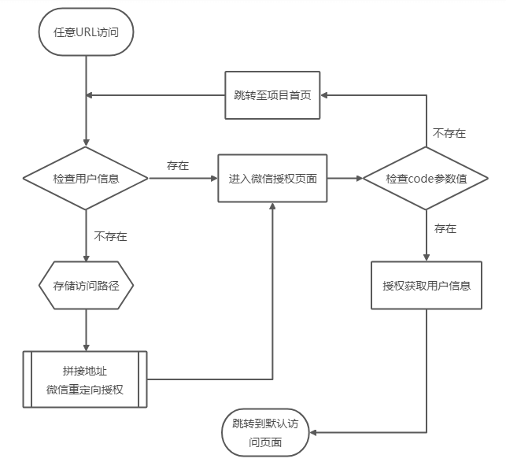

# vue-cli 微信授权登录

### 前言

&emsp;&emsp;使用 **Vue** 开发的 **SPA** 项目 **H5** 版需要在微信端进行 **微信授权** 登录。此次项目 **Mobile** 端与 **PC** 端是部署在同一服务器的不同目录下的。故移动端和 **PC** 端的访问路径是保持一致的，只是子域名有所差异。为了保持路径的一致性，移动端也采用了同 **PC** 端一样的路由模式，即 **history** 模式。

### History 模式和 Hash 模式

&emsp;&emsp;Vue SPA 单页面项目中使用的 **vue-router** 路由有 **hash** 模式和 **history** 模式两种，其默认是 **hash** _模式。history_ 模式与 _hash_ 模式的区别主要有：

-   **hash** 模式下地址栏的 **URL** 路径中会包含一个 ‘**#**’ 号字符，而 **history** 模式下地址栏的 **URL** 中没有 **‘#’** 号。相对来说，_history_ 模式比 _hash_ 模式看起来要美观些。
-   访问路劲和 **URL** 参数位置、拼接先后顺序有所差异。**history** 模式下路径紧接根域名，其后拼接 URL 地址所需的参数；**hash** 模式下，根域名后紧接的是 **URL** 所需的参数，其次是 **‘#’** 拼接所访问的文件所在服务器的路径。
-   两种路由模式的地址跳转方式页有所差异。具体差异请访问 [vue-router 官方网站](https://router.vuejs.org/zh/guide/essentials/history-mode.html) 进一步了解，并根据所需选择合适的路由模式。

### 基本流程



### 代码思路

因为需要先进行微信授权，所以当用户打开网页时会优先进行用户授权信息校验，为了提升用户体验，避免用户明显感觉到微信授权时的页面跳转，故我们在 **vue-router** 的全局权限中加以控制，即在路由生命周期钩子的 **router.beforeEach** 阶段进行拦截处理。
无论从打开的 **URL** 是哪一个路径下进行访问的，都会优先触发 **router.beforeEach** 生命周期钩子函数，在 **router.beforeEach** 中判断用户信息，依据是否存在用户信息来判断是否进行 **微信授权**。
**注**：此次将微信授权的信息存储在了 **sessionStorage** 中。

#### router.js 文件代码：

```javascript title="路由设置"
router.beforeEach((to, from, next) => {
	// 微信授权页路径（空白页）
	if (to.path === "/wx_auth") {
		next();
		return;
	}
	// 校验微信授权时存储的微信授权信息
	let wxInfo = sessionStorage.getItem("微信授权信息_key");
	// 没有用户信息（即未进行微信授权）
	if (!wxInfo) {
		// 存储默认打开时访问的页面路径
		sessionStorage.setItem("wxRedirectUrl", to.path);
		// 处理URL地址栏所携带的参数
		let search = window.location.search;
		if (search.includes("params_key") && search.includes("&")) {
			search = search.split("&")[0];
		}
		// 微信授权获取用户信息指定的路径
		let redirect_uri = encodeURIComponent(`微信服务器域名/wx_auth${search}`);
		// 随机参数（可不传）
		let randomParams = "&state=123";
		window.location.href = `https://open.weixin.qq.com/connect/oauth2/authorize?appid=${APPID}&redirect_uri=${redirect_uri}&response_type=code&scope=snsapi_userinfo${randomParams}#wechat_redirect`;
		return;
	}
});
```

#### WeChatAuth.vue 微信授权页

```javascript title="微信授权"

created() {
    let code = this.getQueryString("code");
    if (code) {
        this.getToken(code);
    } else {
        this.$router.replace("/");
    }
},
methods: {
    // 获取地址栏参数
    getQueryString(n) {
        let r,
            reg = new RegExp("(^|&)" + n + "=([^&]*)(&|$)");
        r = window.location.search.substr(1).match(reg);
        return r ? decodeURI(r[2]) : null;
    },
    // 获取token
    getToken(code) {
        this.$axios
            .get("wxauth_api", { params: { code } })
            .then(res => {
                if (res.data.code == 1) {
                    let data = res.data.result_data;
                    // 校验获取到的用户信息是否为空（code只能用一次）
                    if (!flag) {
                        // 存储微信授权用户信息
                        sessionStorage.setItem("wxInfo", JSON.stringify(data));
                        // 获取初次访问的URL地址
                        let redirectUrl = sessionStorage.getItem("wxRedirectUrl");
                        // 重新打开指定页面
                        this.$router.replace(redirectUrl);
                    } else {
                        if (sessionStorage.getItem("wxInfo")) {
                            let redirectUrl = sessionStorage.getItem("wxRedirectUrl");
                            this.$router.replace(redirectUrl);
                        }
                    }
                } else {
                    console.log("用户授权失败：", res.data.message);
                }
            })
            .catch(err => { });
    }
}
```

:::danger 注意事项：

-   微信授权时有 code，就进行微信授权操作，获取用户信息校验通过之后跳转指定路径。
-   有 code 值但获取用户校验信息失败可能是由于刷新所造成的，此时也跳转到固定的访问页面。
-   主要是防止回退时，页面停留在微信授权页没有反应，这样不利用提升用户体验，还容易给用户操作和体验效果带来一定的负面的影响，不利用用户体验。

:::
