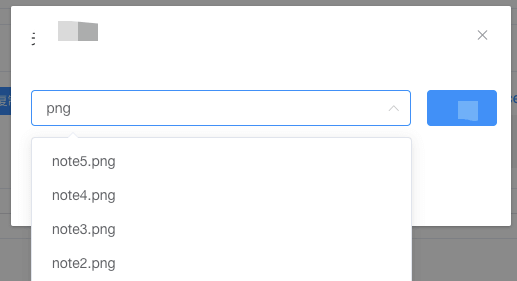

# 下拉选择框大量数据优化

### 业务场景

近期着手开发基于 ElementUI 的后台管理系统，偶然间发现「**el-select**」下拉选择时候遇到一个问题，当渲染下拉选项的「**options**」的数据量过多时「本项目中的 **数据条目已过万**」，就会出现下拉选择器卡顿的情况，尤其是在模糊匹配过滤的情况下，显得十分的卡顿。初始化选择器的时候，也会点击无反应，有时候需要点击多次才可出现 **「dialog」** 弹窗（本次下拉筛选在弹窗中实现）。
翻阅多篇博客笔记之后，最终找到一个可以解决问题的方案，现将此次优化方案记录成为笔记，以便于日后遇到类似问题的时候便于查阅。

### 「📷」图示效果



:::info 注：
基于 el-select 的下拉筛选，通过自定义事件来实现模糊搜索匹配。
:::

一共两种方案：

1.  获取所有数据，通过输入的 **关键字** 自己对获取的数据进行过滤处理；
1.  通过输入的 **关键字** 来动态请求后台接口，通过接口返回的数据来动态渲染下拉选项；

### 「🍵」代码实现

-   🌰Vue 组件实例

```html title="代码示例"
<template>
	<div class="app">
		<el-dialog title="标题" :visible.sync="relatedOpen" :append-to-body="true" width="500px">
			<el-row :gutter="16">
				<el-col :span="20">
					<el-select
						v-model="value"
						filterable
						clearable
						style="width:100%"
						placeholder="请选择"
						:loading="searchLoad"
						:filter-method="filterMethod"
						v-el-select-loadmore="loadMore(rangeNumber)"
						@visible-change="visibleChange"
					>
						<el-option
							v-for="item in options.slice(0, rangeNumber)"
							:key="item.key"
							:label="item.value"
							:value="item.key"
						></el-option>
					</el-select>
				</el-col>
				<el-col :span="4">
					<el-button type="primary" @click="submit">确定</el-button>
				</el-col>
			</el-row>
		</el-dialog>
	</div>
</template>
```

-   🚗「**v-el-select-loadmore**」为自定义指令封装的数据加载指令，是为了解决和优化 elementUI 下拉选择器加载数据过多出现卡顿问题的。
-   🚴「**filter-method**」是下拉选择器的一个自定义属性，可以监听输入的变量，从而依据变量来实现数据的动态获取；

```javascript title="自定义指令"
  // 自定义指令
  directives: {
    "el-select-loadmore": (el, binding) => {
      // 获取Element UI定义好的scroll元素
      const SELECTWRAP_ROM = el.querySelector(".el-select-dropdown .el-select-dropdown__wrap");
      if (SELECTWRAP_ROM) {
		// 添加scroll事件
        SELECTWRAP_ROM.addEventListener("scroll", function() {
			// 判断滚动
          const condition = this.scrollHeight - this.scrollTop <= this.clientHeight;
          condition && binding.value();
        });
      }
    }
  }
```

-   相应的数据函数

```javascript title="数据函数"
export default {
	data() {
		return {
			relatedOpen: false,
			options: [] /* 选择下拉框的值 */,
			courseList: [],
			rangeNumber: 10,
			searchLoad: false /* 下拉框的loading状态 */,
			value: "",
			timer: null
		};
	},
	created() {
		this.getOptions();
	},
	methods: {
		// 按需加载
		loadMore(n) {
			return () => (this.rangeNumber += 5);
		},
		// 过滤课件
		filterMethod(query) {
			if (this.timer != null) clearTimeout(this.timer);
			!this.searchLoad && (this.searchLoad = true);
			this.timer = setTimeout(() => {
				this.options = !!query
					? this.courseList.filter(el => el.value.toLowerCase().includes(query.toLowerCase()))
					: this.courseList;
				clearTimeout(this.timer);
				this.searchLoad = false;
				this.rangeNumber = 10;
				this.timer = null;
			}, 500);
		},
		// 监听select下拉框的显示和隐藏
		visibleChange(flag) {
			// 显示时初始化列表
			flag && this.filterMethod("");
			// 初始化默认值
			this.rangeNumber = 10;
		},
		// 获取选项
		async getOptions() {
			await searchCourseware().then(res => {
				let list = res.data || [];
				// 默认展示的数据
				this.options = list;
				// 原始数据
				this.courseList = list;
			});
		}
	}
};
```

:::danger 注意事项：

-   定时器作用是防止输入筛选的关键字太过频繁，从而造成数据响应不及时；因为本次是一次性获取了全部的数据，所以这里只是用做渲染加载数据；
-   选择器的事件函数主要是用来初始化“获取焦点”和“失去焦点”时处理默认展示数据用的，若是获取的网络请求，此处需要做“函数截流”处理。目的是减少接口请求次数。

:::

### 「🍎」总结：

&emsp;&emsp;换了新的工作环境，现开始着手做后台管理系统，或多或少会遇到各种各样的问题。一如即往，会在笔记中记录开发中遇到的问题。好记性不如烂笔头，希望现在埋下种子，等到来年秋天的时候会收获 🍒 果实。⛽️「加油 😯」
