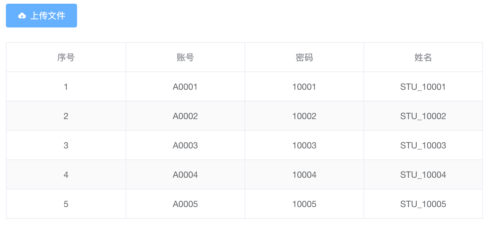

# XLS 文件解析

### 「🚀」场景需求

&emsp;&emsp;前边文章已经对“XLSX 转 JSON”做了相应的处理，早期需求比较紧张，就优先考虑了目前主流的“LSX”格式的 Excel 文件解析。但是投入使用后发现有一部分用户的操作系统偏老旧，他们办公处理文档还是基于早期的“office”办公软件进行工作的；为了支持“xls”文档的解析，寻找了好多方案进行处理；处理时不仅要考虑兼容性还要考虑插件包的内存大小、兼容性、使用是否便捷等一系列因素，最终采用“xlsx.js”来实现解析“xls”文件。
在处理 Demo 案例过程中发现，“xlsx.js”对“xlsx”格式文件和“xls”格式文件均支持，相对之前处理“xlsx”格式文件时，需要对文件流进行加载处理，具体方法可以参考如下代码案例。

### 「🚢」功能实现

:::info 提示「🔔」：
&emsp;&emsp;前端解析 **Excel** 文件是基于 sheetjs 的`xlsx` 包实现文件解析的，接下来是具体的实现步骤和注意事项「注：支持 xlsx 和 xls 及其它格式文件的解析」
:::

-   安装方式一：

```shell title="方式一"
npm install xlsx --save

yarn add xlsx

pnpm add xlsx
```

-   安装方式二：

```shell title="方式二"
npm i --save https://cdn.sheetjs.com/xlsx-0.20.0/xlsx-0.20.0.tgz

yarn add https://cdn.sheetjs.com/xlsx-0.20.0/xlsx-0.20.0.tgz

pnpm install https://cdn.sheetjs.com/xlsx-0.20.0/xlsx-0.20.0.tgz
```

-   读取 XLS 文件

```js title="读取文件"
// 引入解析excel文件解析包
import { read, utils } from "xlsx";
// 引入转换解析数据的包
import ConvertToJson from "read-excel-file/schema";

/**
 * @description Xls文件转JSON数据
 * @param {Object} file xls文件对象
 * @param {Object} keyProps 表头和属性值对应关系：{'用户名':{prop:'username',type:String}...}
 * @param {Object} emptyItem 数据项默认值对象
 * @param {Number} titleRows 表头说明所占用行数
 * @return {Object} 解析异常时返回值为null，正常情况下返回Array数组
 **/
export const XlsToData = (file, keyProps, emptyItem, titleRows = 0) => {
	return new Promise((resolve, reject) => {
		// 初始化FileReader对象实例
		const FR = new FileReader();

		// 读取成功
		FR.addEventListener("loadend", evt => {
			// 文件对象
			const FB = evt.target.result;

			// 读取数据
			const WB = read(FB);

			// 转换二维数组数据
			let fileXls = utils.sheet_to_json(WB.Sheets[WB.SheetNames[0]], { header: 1 });

			// 判断解析的数据是否是二维数组
			if (!(Array.isArray(fileXls) && fileXls.length)) return resolve([]);

			// 赋值默认数据对象
			let emptyStmp = { ...emptyItem };

			// 截取数据体
			let xlsData = fileXls.splice(titleRows);

			// 转换后的数据
			const { rows } = ConvertToJson(xlsData, keyProps);

			// 处理后的数据
			let list = rows?.map((row, index) => Object.assign({ index }, emptyStmp, row));
			resolve(list);
		});

		// 读取失败
		FR.addEventListener("error", () => reject(null));

		// 读取数据
		FR.readAsArrayBuffer(file);
	});
};
```

-   xlsx 使用文档-sheetjs

[SheetJS 文档](https://docs.sheetjs.com/)「👈 点击查看文档」

-   要读取的 XLS 文件源数据
    | **账号** | **密码** | **姓名** |
    | --- | --- | --- |
    | A0001 | 10001 | STU_10001 |
    | A0002 | 10002 | STU_10002 |
    | A0003 | 10003 | STU_10003 |
    | A0004 | 10004 | STU_10004 |
    | A0005 | 10005 | STU_10005 |

-   解析 xls 文件数据

```json title="读取数据"
[
	["账号", "密码", "姓名"],
	["A0001", 10001, "STU_10001"],
	["A0002", 10002, "STU_10002"],
	["A0003", 10003, "STU_10003"],
	["A0004", 10004, "STU_10004"],
	["A0005", 10005, "STU_10005"]
]
```

-   转换数据「将解析生成的二维数组转换成后端所需的 **JSON 数组对象**，此处需要借助 “**schema**” 包进行解析处理」
-   数据转换只转数据体，所以 **XLS** 文件的标头无需处理，故在进行转换数据之前需将标头该一组数据移除掉

```json title="解析数据"
[
	["A0001", 10001, "STU_10001"],
	["A0002", 10002, "STU_10002"],
	["A0003", 10003, "STU_10003"],
	["A0004", 10004, "STU_10004"],
	["A0005", 10005, "STU_10005"]
]
```

-   转换数据所需参数配置

```js title="转换参数"
// 匹配转换的数据字段
let keyProp = {
	账号: {
		prop: "username",
		type: String
	},
	密码: {
		prop: "password",
		type: String
	},
	姓名: {
		prop: "studentname",
		type: String
	}
};

// 空值数据
let emptyItem = {
	username: "",
	password: "",
	studentname: ""
};
```

-   转换后的 JSON 数据

```json title="JSON 数据格式"
[
	{
		"index": 0,
		"username": "A0001",
		"password": 10001,
		"studentname": "STU_10001"
	},
	{
		"index": 1,
		"username": "A0002",
		"password": 10002,
		"studentname": "STU_10002"
	},
	{
		"index": 2,
		"username": "A0003",
		"password": 10003,
		"studentname": "STU_10003"
	},
	{
		"index": 3,
		"username": "A0004",
		"password": 10004,
		"studentname": "STU_10004"
	},
	{
		"index": 4,
		"username": "A0005",
		"password": 10005,
		"studentname": "STU_10005"
	}
]
```

### 「🚄」效果展示

:::info XLS 文件上传前的文件展示效果区域

:::

:::info XLS 文件解匹配后的数据展示效果

:::

### 「🚗」分析总结

&emsp;&emsp;上述笔记是对 Excel 文件的 **XLS** 格式的文件进行解析处理的；对比 **XLSX** 文件的解析，**XLS** 格式的解析多了文件流读取这一步骤。**XLSX** 格式文件也可以用过上述方式来解析生成 **JSON** 格式的数据，已在实际开发中使用和验证。

&emsp;&emsp;若需整合支持 Excel 文件数据的解析，可以直接使用 **“xlsx”** 包进行解析，也可以使用 **“read-excel-file”** 包进行解析，两种方式均可，相对来说 **“xlsx”** 包支持的文件种类比较多些；**“read-excel-file”** 包比较小，仅支持 **“xlsx”** 一种数据格式文件的解析。可以根据自己开发过程中实际场景需求来选取符合自己要求的方案。
