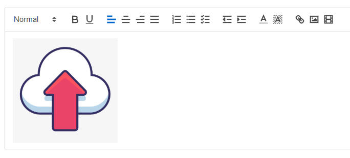

# # 「富文本编辑器」vue2-editor

&emsp;&emsp;在后台管理系统开发的过程中，富文本编辑器是经常会用到的一种文本编辑工具。目前主流的富文本编辑器有很多，但总有一款是符合自己需求的。在周末花费了大约半天的时间，尝试了许多富文本编辑器，大体上功能都相差无几。主要是对富文本中图片的处理，各个种类的富文本对图片的处理差异还是挺大的。此处的所说的图片处理指的是图片的大小调整、位置调整、是否可以拖拽等。此次我使用的富文本编辑器是 **vue2-editor**，并结合实际情况进行了相应调整。

&emsp;&emsp;**[vue2-editor](https://www.vue2editor.com/)** 富文本编辑器是基于 [vue-quill-editor](https://github.surmon.me/vue-quill-editor/) 富文本编辑器进行改造的，如果有问题可以访问文档进行问题的查找。

#### 插件安装

-   **vue2-editor：富文本编辑器**

```bash title="代码示例"
yarn add vue2-editor
```

-   **quill-image-drop-module：图片拖拽**
-   **quill-image-resize-module：图片大小调整**

```bash title="代码示例"
yarn add quill-image-drop-module --dev
yarn add quill-image-resize-module --dev
```

#### 封装 Editor 组件

```html title="代码示例"
<template>
	<div class="editor">
		<vue-editor
			v-model="editorHtml"
			:customModules="customModulesForEditor"
			:editorOptions="editorSettings"
			:editorToolbar="customToolbar"
			useCustomImageHandler
			@image-added="handleImageAdded"
			@blur="onEditorBlur"
		/>
	</div>
</template>

<script>
	// 引入vue2wditor
	import { VueEditor } from "vue2-editor";
	// 导入图片操作相关插件
	import { ImageDrop } from "quill-image-drop-module";
	import ImageResize from "quill-image-resize-module";

	export default {
		name: "Vue2Editor",
		components: { VueEditor },
		props: {
			defaultText: { type: String, default: "" },
			richText: { type: String, default: "" }
		},
		watch: {
			// 监听默认值回调
			defaultText(nv, ov) {
				if (nv != "") {
					this.editorHtml = nv;
					this.$emit("update:rich-text", nv);
				}
			}
		},
		data() {
			return {
				editorHtml: "",
				// 菜单栏
				customToolbar: [
					[{ header: [false, 1, 2, 3, 4, 5, 6] }],
					["bold", "underline"],
					[{ align: "" }, { align: "center" }, { align: "right" }, { align: "justify" }],
					[{ list: "ordered" }, { list: "bullet" }, { list: "check" }],
					[{ indent: "-1" }, { indent: "+1" }],
					["color", "background"],
					["link", "image", "video"]
				],
				// 调整图片大小和位置
				customModulesForEditor: [
					{ alias: "imageDrop", module: ImageDrop },
					{ alias: "imageResize", module: ImageResize }
				],
				// 设置编辑器图片可拖拽
				editorSettings: {
					modules: { imageDrop: true, imageResize: {} }
				}
			};
		},
		mounted() {},
		methods: {
			// 自定义图片上传
			handleImageAdded(file, Editor, cursorLocation, resetUploader) {
				// 文件上传：$oss图片文件上传插件是自己封装的阿里云oss文件直传，此处代码自定义
				this.$oss(file, file.name).then(url => {
					if (!!url) {
						Editor.insertEmbed(cursorLocation, "image", url);
						resetUploader();
					}
				});
			},
			// 失去焦点
			onEditorBlur(quill) {
				this.$emit("update:rich-text", this.editorHtml);
			}
		}
	};
</script>

<style scoped>
	/* 处理添加视频链接标签位置 */
	.editor >>> .ql-snow .ql-tooltip {
		top: 0 !important;
		left: 40% !important;
	}
</style>
```

#### 使用 Editor 组件

```html title="代码示例"
<template>
	<div class="home">
		<el-card shadow="never">
			<div slot="header" class="clearfix">
				<h1>Editor 编辑器</h1>
			</div>
			<!-- 编辑器 -->
			<Editor :defaultText="defaultText" :richText.sync="richText" />
		</el-card>
	</div>
</template>

<script>
	// 导入插件
	import Editor from "../components/Editor";

	export default {
		name: "Home",
		components: { Editor },
		data() {
			return {
				defaultText: "",
				richText: ""
			};
		}
	};
</script>
```

参考图：


:::danger 注意事项：
&emsp;&emsp;当引入调整的图片的两个插件时，vue 控制台会报无法找到 **Quill.js**。**vue2editor** 官方给的解决办法是基于 webpack4.x 的，如果报错，说明当前项目使用的 **webpack** 版本较高，现在的解决办法就是针对高版本 **webpack** 的即 **vue-cli 版本＞ 4.x**。

&emsp;&emsp;解决办法：

&emsp;&emsp;修改 **vue.config.js** 文件，在文件顶部导出 **webpack** 模块，然后根据修改要求对 **webpack** 进行相应的调整和设置。代码如下：
:::

```js title="代码示例"
// webpack
const webpack = require("webpack");
// gzip

module.exports = {
	chainWebpack: config => {
		// 压缩代码
		config.optimization.minimize(true);
		// 分割代码
		config.optimization.splitChunks({ chunks: "all" });
		// 用cdn方式引入
		config.externals({
			//vue: "Vue"
		});
		// Quill.js文件引入失败配置
		config.plugin("provide").use(webpack.ProvidePlugin, [
			{
				"window.Quill": "quill/dist/quill.js",
				Quill: "quill/dist/quill.js"
			}
		]);
	}
};
```

:::danger 提示
&emsp;&emsp;因为业务需要，移动端图片要 **100%** 占满全屏，所以当前使用的基于**quill** 的图片拖拽无法达到 **宽度 100%** 的效果，拖拽后的图片大小是**指定的像素宽度**，若对图片宽度有特定要求，此富文本的图片上传可能适合你，若动手能力强，可自行改造。
:::
