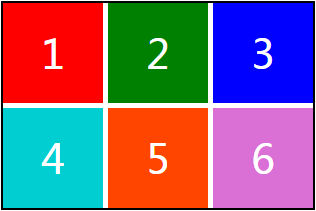

# CSS 页面布局技巧

#### 1、元素上下垂直水平居中


相关代码：

```html title="html 代码示例"
<div class="demo1">
	<div class="cont"></div>
</div>
```

```css title="css 代码示例"
.demo1 {
	height: 300px;
	background-color: lightblue;
	/* 布局方式 */
	display: flex;
}

.demo1 > .cont {
	width: 100px;
	height: 100px;
	background-color: lightseagreen;
	/* 主要代码 */
	margin: auto;
}
```

#### 2、导航条元素居右


实现代码：

```html title="html 代码示例"
<div class="demo2">
	<li>首页</li>
	<li>动态</li>
	<li>话题</li>
	<li>活动</li>
	<!-- 登录&注册居右 -->
	<li>登录 &nbsp; 注册</li>
</div>
```

```css title="css 代码示例"
.demo2 {
	list-style: none;
	background-color: lightseagreen;
	color: white;
	padding: 1em 0.5em;
	/* 布局方式 */
	display: flex;
}

.demo2 > li {
	padding: 0 0.5rem;
}

.demo2 > li:last-child {
	/* 主要实现代码 */
	margin-left: auto;
}
```

#### 3、Loading 渐变动画效果


[](https://www.yuque.com/zhangxiaokang/web/web_14?_lake_card=%7B%22status%22%3A%22done%22%2C%22name%22%3A%22loading%E6%B8%90%E5%8F%98.mp4%22%2C%22size%22%3A540597%2C%22percent%22%3A0%2C%22id%22%3A%222q8PB%22%2C%22videoId%22%3A%22d643ec4a8e2341e68429d883d5efca20%22%2C%22coverUrl%22%3A%22https%3A%2F%2Fcdn.nlark.com%2Fyuque%2F0%2F2019%2Fjpeg%2F271255%2F1554951846663-7f70dd1a-3b14-469a-a322-c4f022f48053.jpeg%22%2C%22aliyunVideoSrc%22%3Anull%2C%22taobaoVideoId%22%3A%22223312102836%22%2C%22uploaderId%22%3A271255%2C%22authKey%22%3A%22YXBwX2tleT04MDAwMDAwMTImYXV0aF9pbmZvPXsidGltZXN0YW1wRW5jcnlwdGVkIjoiMmNjMWU3MGEzMzkyY2E5ZjgyZmZkOGY1YjJiZmMzZGQifSZkdXJhdGlvbj0mdGltZXN0YW1wPTE1NjQ3MTI4MTg%3D%22%2C%22docUrl%22%3A%22https%3A%2F%2Fwww.yuque.com%2Fzhangxiaokang%2Fweb%2Fweb_14%22%2C%22card%22%3A%22video%22%7D#2q8PB)

实现代码：

```html title="html 代码示例"
<body>
	<p class="loading">Loading...</p>
</body>
```

```css title="css 代码示例"
body {
	margin: 0;
	display: flex;
	min-height: 100vh;
	text-align: center;
	background: #655;
	color: white;
}

.loading {
	margin: auto;
}

.loading:before {
	content: "";
	display: block;
	width: 4em;
	height: 4em;
	margin: 0 auto 1em;
	border: 1.5em solid;
	color: yellowgreen;
	box-sizing: border-box;
	animation: 1s spin, 0.7s radius, 1.1s color, 1.3s width;
	animation-timing-function: linear;
	animation-iteration-count: infinite;
}

@keyframes spin {
	to {
		transform: rotate(1turn);
	}
}

@keyframes radius {
	50% {
		border-radius: 50%;
	}
}

@keyframes color {
	33% {
		color: orange;
	}

	66% {
		color: deeppink;
	}
}

@keyframes width {
	50% {
		border-width: 0.4em;
	}
}
```

#### 4、Grid 栅格布局



实现代码：

```html title="html 代码示例"
<div class="wrapper">
	<div style="background: red;">1</div>
	<div style="background: green;">2</div>
	<div style="background: blue;">3</div>
	<div style="background: darkturquoise;">4</div>
	<div style="background: orangered;">5</div>
	<div style="background: orchid;">6</div>
</div>
```

```css title="css 代码示例"
.wrapper {
	width: 310px;
	height: 205px;
	border: 2px solid black;
	margin: 100px;
	color: #fff;
	text-align: center;
	line-height: 100px;
	font-size: 40px;
	/* grid栅格布局 */
	display: grid;
	/* 列宽：每个值对应一列 */
	grid-template-columns: 100px 100px 100px;
	/* 行高：每个值对应当前行的行高 */
	grid-template-rows: 100px 100px;
	/* 列与列之间的间隔宽度 */
	grid-column-gap: 5px;
	/* 行与行之间的间隔宽度 */
	grid-row-gap: 5px;
}
```

#### 5、Grid 九宫格布局


实现代码：

```html title="html 代码示例"
<!-- display:grid;栅格布局 -->
<div id="wapBox">
	
	
	
	
	
	
	
	
	
</div>
```

```css title="css 代码示例"
#wapBox {
	border: 5px solid orangered;
	width: 310px;
	/* height: 205px; */
	margin: 100px;
	color: #fff;
	text-align: center;
	line-height: 100px;
	font-size: 40px;
	/* grid栅格布局 */
	display: grid;
	/* 列宽：每个值对应一列 */
	grid-template-columns: 100px 100px 100px;
	/* 行高：每个值对应当前行的行高 */
	grid-template-rows: 100px 100px;
	grid-column-gap: 5px;
	grid-row-gap: 5px;
}

#wapBox img {
	width: 100px;
	height: 100px;
	display: block;
}
```
