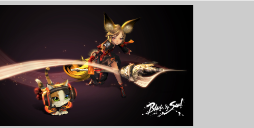
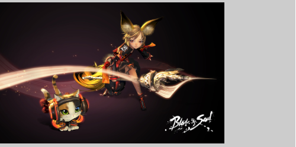
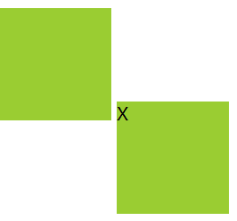
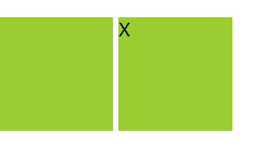
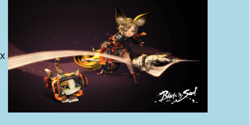
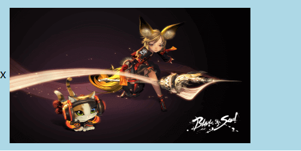
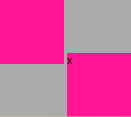
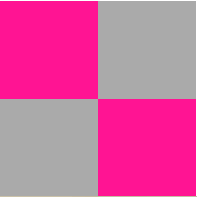

# vertical-align 属性

#### 1、Demo1 案例：img 元素底部间隙问题

```html
<div class="demo1">
	
</div>
```

```css
.demo1 {
	background-color: #20b2aa;
}

img {
	width: 200px;
}
```

**注：图片底部有一定高度的间隙**


```css
.demo1 {
	background-color: #20b2aa;
	font-size: 0;
}

img {
	width: 200px;
}
```

方法一：给父元素设置 **font-size: 0px **清除底部多余间隙

```css
.demo1 {
	background-color: #20b2aa;
}

img {
	width: 200px;
	vertical-align: bottom;
}
```

方式二：给行 内块元素设置 **vertical-align: bottom**（**推荐使用该方法**）


#### 2、Demo2 案例：img 元素居中上下留白高度不一致问题

```html
<div class="demo2">
	
	<!-- 解决问题后续添加的占位元素 -->
	<div></div>
</div>
```

```css
.demo2 {
	width: 400px;
	height: 200px;
	line-height: 200px;
	background-color: #cccccc;
}

img {
	height: 190px;
	vertical-align: middle;
}
```

**注：图片上下间隙不对称**



**解决办法：**

```css
.demo2 {
	width: 400px;
	height: 200px;
	line-height: 200px;
	background-color: #cccccc;
	/* 1、font-size: 0px; 行内元素垂直对齐 */
	font-size: 0px;
}
```

方法一：给父元素添加  **font-size: 0px** 行内元素垂直对齐

```css
.demo2 {
	width: 400px;
	height: 200px;
	/* line-height: 200px; */
	background-color: #cccccc;
}

.demo2 div {
	display: inline-block;
	height: 100%;
	width: 0;
	vertical-align: middle;
}
```

方法二：去掉父元素的行高，添加一个与父元素等高的子元素，并设置** vertical-align: middle**
**注：**

1. 兄弟元素影响父元素的基线，而图片的定位是需要父元素的基线的
2. 父元素的基线受  **vertical-align **影响
3. 父元素的 **font-size**
4. 父元素的** line-height **
5. 某个子元素的对齐方式

#### 3、Demo3 案例：行内块元素的错位问题

```html
<div class="d3"></div>
<div class="d3 d3b">X</div>
```

```css
div.d3 {
	display: inline-block;
	width: 100px;
	height: 100px;
	background-color: #9acd32;
}
```

注：行内元素若没有文字的时候它的基线为元素的底部，若有文字则为内部文字的基线位置



**解决办法：**

```css
.d3b {
	overflow: hidden;
}
```

注：给第二个包含文本的元素添加** \*\***overflow: hidden，\*\*元素不再出现错位



#### 4、Demo4 案例：文本&行内块元素垂直居中

```html
<div class="demo4">
	x
	
	<!-- 为实现垂直居中而后添加的元素 -->
	<div></div>
</div>
```

```css
.demo4 {
	width: 400px;
	height: 200px;
	background-color: #add8e6;
}

.demo4 img {
	width: 320px;
	height: 180px;
	vertical-align: middle;
}
```

**注：子元素没有相对父元素居中**

**解决办法：**

```css
.demo4 > div {
	display: inline-block;
	width: 0;
	height: 100%;
	vertical-align: middle;
	background-color: bisque;
}
```

**注**：行内元素没有文字的时候它的基线为元素的底部，若有文字则为内部文字基线位置。


#### 5、Demo5 案例：文本影响元素基线对齐方式

```html
<div class="demo5">
	<div></div>
	<div>x</div>
</div>
```

```css
.demo5 {
	display: inline-block;
	/* 影响对齐方式 */
	font-size: 0px;
	background-color: #aaaaaa;
}

.demo5 > div {
	display: inline-block;
	width: 100px;
	height: 100px;
	background-color: #ff1493;
}
```

图一：错位                                          


图二：理想状态


**注**：对父元素添加  **font-size: 0**
去掉父元素的** font-size: 0px** 带有字母的盒子就会错位；第二个盒子继承父元素的行高，而行高大于元素本身的高度，所以就挤出了盒子，而第一个盒子对齐的是父元素的基线，而父元素的基线被第二个盒子拉了下来。
