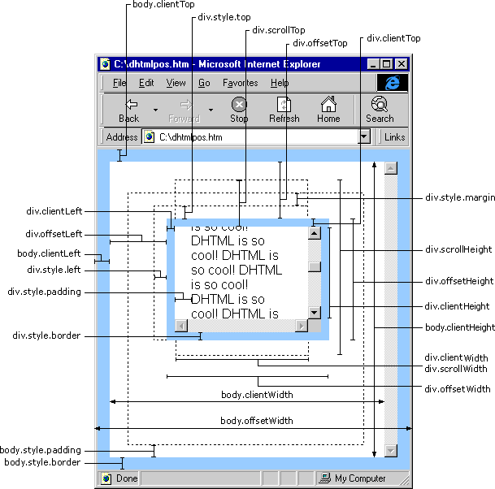

# Web 页面定位相关属性

### 一、获取宽高相关属性

1. `scrollHeight`：获取对象的滚动高度；
2. `scrollLeft`：设置或获取位于对象左边界和窗口中目前可见内容的最左端之间的距离；
3. `scrollTop`：设置或获取位于对象最顶端和窗口中可见内容的最顶端之间的距离；
4. `scrollWidth`：获取对象的滚动宽度；
5. `offsetHeight`：获取对象相对于版面或由父坐标 `offsetParent` 属性指定的父坐标的高度；
6. `offsetLeft`：获取对象相对于版面或由 `offsetParent` 属性指定的父坐标的计算左侧位置；
7. `offsetTop`：获取对象相对于版面或由 `offsetTop` 属性指定的父坐标的计算顶端位置；
8. `event.clientX` ：相对文档的水平座标；
9. `event.clientY` ：相对文档的垂直座标；
10. `event.offsetX` ：相对容器的水平坐标；
11. `event.offsetY` ：相对容器的垂直坐标；
12. `document.documentElement.scrollTop` ：垂直方向滚动的值；
13. `event.clientX` + `document.documentElement.scrollTop` ：相对文档的水平座标 + 垂直方向滚动的量；

### 二、页面迁移转变代码的常用属性

1. 页可见区域宽：`document.body.clientWidth`；
2. 网页可见区域高：`document.body.clientHeight`；
3. 网页可见区域宽：`document.body.offsetWidth` **（包含边线的宽）**；
4. 网页可见区域高：`document.body.offsetHeight` **（包含边线的宽）**；
5. 网页正文全文宽：`document.body.scrollWidth`；
6. 网页正文全文高：`document.body.scrollHeight`；
7. 网页被卷去的高：`document.body.scrollTop`；
8. 网页被卷去的左：`document.body.scrollLeft`；
9. 网页正文项目组上：`window.screenTop`；
10. 网页正文项目组左：`window.screenLeft`；
11. 屏幕辨别率的高：`window.screen.height`；
12. 屏幕辨别率的宽：`window.screen.width`；
13. 屏幕可用工作区高度：`window.screen.availHeight`；

:::tip 参照图：

:::

### 三、相关属性及属性值的使用注意事项

#### 1、offsetLeft

-   假设 obj 为某个 HTML 控件：
    -   obj.offsetTop 指 obj 间隔上方或上层控件的地位，整型，单位 **像素**
    -   obj.offsetLeft 指 obj 间隔左方或上层控件的地位，整型，单位 **像素**
    -   obj.offsetWidth 指 obj 控件自身的宽度，整型，单位 **像素**
    -   obj.offsetHeight 指 obj 控件自身的高度，整型，单位 **像素**
-   代码实例

```html title="示例代码"
<div id="tool">
	<input type="button" value="提交" />
	<input type="button" value="重置" />
</div>
```

-   “提交” 按钮的 offsetTop 指 “提交” 按钮距 “tool” 层上边框的间隔，因为距其上边比来的是 “tool” 层的上边框
-   “重置” 按钮的 offsetTop 指 “重置” 按钮距 “tool” 层上边框的间隔，因为距其上边比来的是 “tool” 层的上边框
-   “提交”按钮的 offsetLeft 指“提交”按钮距 “tool” 层左边框的间隔，因为距其左边比来的是 “tool” 层的左边框
-   “重置”按钮的 offsetLeft 指 “重置” 按钮距 “提交” 按钮右边框的间隔，因为距其左边比来的是 “提交” 按钮的右边框

注：以上属性在 **FireFox** 中也有效

#### 2、offsetTop 与 style.top 的差别

-   offsetTop 可以获得 `HTML` 元素间隔上方或外层元素的地位，`style.top` 也是可以的，两者差别：
    -   `offsetTop` 返回的是数字，而 `style.top` 返回的是字符串，除了数字外还带有单位：**px**
    -   `offsetTop` 只读，而 `style.top` 可读写
    -   若是没有给 `HTML` 元素指定过 `top` 样式，则 `style.top` 返回的是空字符串

注：**offsetLeft** 与 **style.left**、**offsetWidth** 与 **style.width**、**offsetHeight** 与 **style.height** 也是同样事理

#### 四种浏览器分别为 IE（Internet Explorer）、NS（Netscape）、Opera、FF（FireFox）

#### 3、clientHeight

-   内容可视区域的高度，页面浏览器中可以看到内容的这个区域的高度
-   透过浏览器看内容的这个区域高度

#### 4、offsetHeight

-   IE、Opera 认为 `offsetHeight` = `clientHeight` + 迁移转变条 + 边框
-   NS、FF 认为 `offsetHeight` 是网页内容实际高度，可以小于 `clientHeight`

#### 5、scrollHeight

-   IE、Opera 认为 `scrollHeight` 是网页内容实际高度，可以小于 `clientHeight`
-   NS、FF 认为 `scrollHeight` 是网页内容高度，不过最小值是 `clientHeight`
-   内部元素的绝对宽度，包含内部元素的隐蔽的项目组

#### 6、scrollTop

-   “卷” 起来的高度值

#### 7、clientLeft

-   返回对象的 offsetLeft 属性值和到当前窗口左边的真实值之间的间隔

#### 各属性简介

> offsetTop、offsetLeft、offsetWidth、offsetHeight、offsetParent 等属性简述

-   offsetTop
    -   当前对象到其上级层顶部的间隔
    -   不可以对其进行赋值.设置对象到页面顶部的间隔请用 `style.top` 属性
-   offsetLeft
    -   当前对象到其上级层左边的间隔
    -   不可以对其进行赋值.设置对象到页面左部的间隔请用 `style.left` 属性
-   offsetWidth
    -   当前对象的宽度
    -   与 `style.width` 属性的差别在于:如对象的宽度设定值为百分比宽度，则无论页面变大还是变小，**style.width** 都返回此百分比，而 `offsetWidth` 则返回在不合页面中对象的宽度值而不是百分比值
-   offsetHeight
    -   当前对象到其上级层顶部的间隔
    -   不可以对其进行赋值.设置对象到页面顶部的间隔请用 `style.top` 属性
-   offsetParent
    -   若是对象是包含在一个 `div` 中时，此 `div` 不会被当做是此对象的上级层，（即对象的上级层会跳过 `div` 对象）上级层是 `table` 时则不会有
