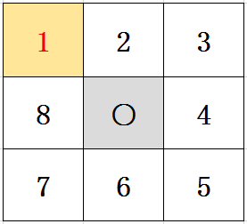

# 九宫格抽奖案例

### 抽奖模型和拼接模型

-   九宫格模型「图 1」
    

-   拼接图模型「图 2」
    

:::tip 提示「📢」：
&emsp;&emsp;当动态实现九宫格奖品信息展示时，若想按照图 1 位置显示奖品信息，则此时需要换一下九宫格的位置。
&emsp;&emsp;替换位置为：4→8、6→4、8→6、9→5、5→○（○ 即抽奖按钮）
:::

### 封装奖品列表排序方法

```javascript title="代码示例"
/* 九宫格奖品列表排序 */
function sortList(data, el) {
	var ID4,
		str = "";
	for (var i = 0; i < data.length; i++) {
		if (i == 3) {
			//3->7
			str += "<div class='prize jp-" + 7 + "'><p>" + data[i].name + "</p></div>";
		} else if (i == 4) {
			// 4
			ID4 = 4;
			str += "<div id='Btn'><p>开始抽奖</p></div>";
		} else if (i == 5) {
			//5->3
			str += "<div class='prize jp-" + 3 + "'><p>" + data[i].name + "</p></div>";
		} else if (i == 7) {
			//7->5、8->4
			str +=
				"<div class='prize jp-" +
				5 +
				"'><p>" +
				data[i].name +
				"</p></div><div class='prize jp-" +
				ID4 +
				"'><p>" +
				data[ID4].name +
				"</p></div>";
		} else {
			str += "<div class='prize jp-" + i + "'><p>" + data[i].name + "</p></div>";
		}
	}
	$("#" + el).html(str);
}

//初始化抽奖按钮点击属性
var click = false;
```

### 初始全局变量（获奖奖品下标）

```javascript title="代码示例"
// 奖品列表
var prizeList,
	// 中奖下标（在奖品列表中的下标）
	prizeObj = {
		pIndex: ""
	};
```

### 奖品动画初始化

```javascript title="代码示例"
var luck = {
	index: -1, //当前转动到哪,起点位置
	count: 0, //共有多少个位置
	timer: 0, //setTimeout的ID,用clearTimeout清除
	speed: 20, //初始化转动速度
	times: 0, //转动次数
	cycle: 25, //转动基本次数:即转动多少次之后进入抽奖环节
	prize: -1, //中奖位置
	init: function (id) {
		if ($("#" + id).find(".prize").length > 0) {
			$luck = $("#" + id);
			$units = $luck.find(".prize");
			this.obj = $luck;
			this.count = $units.length;
			$luck.find(".jp-" + this.index).addClass("active");
		}
	},
	roll: function () {
		var index = this.index;
		var count = this.count;
		var luck = this.obj;
		$(luck)
			.find(".jp-" + index)
			.removeClass("active");
		index += 1;
		if (index > count - 1) index = 0;
		$(luck)
			.find(".jp-" + index)
			.addClass("active");
		this.index = index;
		return false;
	},
	stop: function (index) {
		this.prize = index;
		return false;
	}
};
```

### 时间、转速、中奖下标控制

```javascript title="代码示例"
/* 时间、速度、中奖编号控制 */
function roll() {
	luck.times += 1;
	luck.roll();
	if (luck.times > luck.cycle + 10 && luck.prize == luck.index) {
		clearTimeout(luck.timer);
		luck.prize = -1;
		luck.times = 0;
		click = false;
	} else {
		if (luck.times < luck.cycle) {
			luck.speed -= 20;
		} else if (luck.times == luck.cycle) {
			// 奖品位置下标 全局变量prizeObj对象为中奖信息
			if (prizeObj.pIndex != "") luck.prize = prizeObj.pIndex;
		} else {
			if (luck.times > luck.cycle + 10 && ((luck.prize == 0 && luck.index == 7) || luck.prize == luck.index + 1)) {
				luck.speed += 110;
			} else {
				luck.speed += 20;
			}
		}
		if (luck.speed < 40) luck.speed = 40;
		luck.timer = setTimeout(roll, luck.speed);
	}
	return false;
}
```

### 加载抽奖动画

```javascript title="代码示例"
luck.init("prizeBox");
/* 点击抽奖 */
$("#Btn").click(function () {
	if (click) {
		return false;
	} else {
		$.ajax({
			async: false,
			url: "url",
			type: "post",
			data: {},
			dataType: "json",
			success: function (res) {
				if (res.code) {
					/* 寻找商品下标 */
					// 寻找中奖商品下标代码...

					/* 动画 */
					// 初始转速
					luck.speed = 100;
					// 触发动画
					roll();
					// 激活点击事件
					click = true;
					// 延时动画
					setTimeout(function () {
						$("#mask").fadeIn();
					}, 3600);
					return false;
				} else {
					alert(res.message);
				}
			}
		});
		return false;
	}
});
```

### 中奖奖品位置的判断「回显到九宫格上」

```javascript title="代码示例"
function findPirzeIndex(data, goodId) {
	for (let j = 0, len = data.length; j < len; j++) {
		if (data[j].goodId == goodId) {
			switch (j) {
				case 0:
					prizeObj.pIndex = 0;
					break;
				case 3: // 3->7
					prizeObj.pIndex = 7;
					break;
				case 4: //
					prizeObj.pIndex = 4;
					break;
				case 5: // 5->3
					prizeObj.pIndex = 3;
					break;
				case 7: // 7->5
					prizeObj.pIndex = 5;
					break;
				default:
					prizeObj.pIndex = j;
			}
		}
	}
}
```

:::info 总结：
&emsp;&emsp;通过该方法来查找中奖奖品的位置；查找的元素的下标为该元素在其数组对象中的位置下标，此时对比图 1 和图 2 两个图表的位置信息，就可以确定中奖奖品所在图 1 表盘的具体位置。
:::
