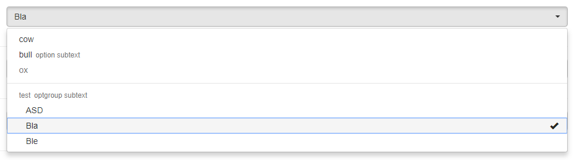

# vue 后台管理系统随笔

### 一、使用 Form 表单实现登录跳转

```html title="页面示例"
<form action="url" method="get/post" onsubmit="return toValid()">
	<div class="input-group">
		<span class="input-group-addon"><b class="glyphicon glyphicon-user"></b></span>
		<input type="text" name="userName" id="userName" class="form-control" placeholder="用户名" />
	</div>
	<div class="input-group">
		<span class="input-group-addon"><b class="glyphicon glyphicon-eye-close"></b></span>
		<input type="password" name="password" id="password" class="form-control" placeholder="密码" />
	</div>
	<div class="input-group loginBtn">
		<input type="submit" class="btn btn-primary" value="登录" />
		<input type="reset" class="btn btn-default" value="重置" />
	</div>
</form>
```

**校验提交表单信息**

```javascript title="页面示例"
function toValid() {
	let user = $("#userName").val().trim(),
		pwd = $("#userPwd").val().trim();
	if (user == "") {
		popWin("warning", "用户名不能为空！", "");
		return false;
	}
	if (pwd == "") {
		popWin("warning", "密码不能为空！", "");
		return false;
	}
	return true;
}
```

:::warning 注意：
&emsp;&emsp;通过 **submit** 按钮提交 **form** 表单数据，通过 **reset** 按钮实现表单的 **重置**。
:::

### 二、设置页面高度撑起全屏

```javascript title="页面示例"
function setContentHeight() {
	var DDE = document.documentElement,
		DBOH = document.body.offsetHeight,
		WIH = window.innerHeight;
	var h = WIH ? WIH : DDE && DDE.clientHeight ? DDE.clientHeight : DBOH;
	document.getElementById("loginPage").style.minHeight = h + "px";
}
setContentHeight();
window.onresize = setContentHeight;
```

:::warning 注意：
&emsp;&emsp;**window.onresize** 方法，动态监测页面变化，从而实现动态改变。
:::

### 三、jQuery 获取 form 表单 value 值，转化为 JSON 数据

```javascript title="页面示例"
let formObj = {},
	formList = $("#formId").serializeArray();
$.each(formList, function () {
	formObj[this.name] = this.value;
});
```

:::warning 注意：
&emsp;&emsp; 使用 jQuery 插件中**$(' **#formId\*\* ').serializeArray(),方法实现 form 表单的 JSON 序列化。
:::

### 四、多文件上传（多个、多类型）

- 效果图：
  

- **jQuery 多文件上传插件源文件**：[文件上传.zip](https://www.yuque.com/attachments/yuque/0/2019/zip/271255/1557729362045-2cb2ccf5-5e0d-456e-9499-191c1b44ebb0.zip?_lake_card=%7B%22uid%22%3A%22rc-upload-1557727440728-57%22%2C%22src%22%3A%22https%3A%2F%2Fwww.yuque.com%2Fattachments%2Fyuque%2F0%2F2019%2Fzip%2F271255%2F1557729362045-2cb2ccf5-5e0d-456e-9499-191c1b44ebb0.zip%22%2C%22name%22%3A%22%E6%96%87%E4%BB%B6%E4%B8%8A%E4%BC%A0.zip%22%2C%22size%22%3A75957%2C%22type%22%3A%22application%2Fx-zip-compressed%22%2C%22ext%22%3A%22zip%22%2C%22progress%22%3A%7B%22percent%22%3A0%7D%2C%22status%22%3A%22done%22%2C%22percent%22%3A0%2C%22id%22%3A%22GANZ6%22%2C%22card%22%3A%22file%22%7D)

#### html 示例代码

```html title="页面示例"
<!DOCTYPE html>
<html lang="zh">
	<head>
		<meta charset="UTF-8" />
		<meta name="viewport" content="width=device-width, initial-scale=1.0" />
		<meta http-equiv="X-UA-Compatible" content="ie=edge" />
		<title>文件上传</title>
		<link rel="stylesheet" type="text/css" href="css/iconfont.css" />
		<link rel="stylesheet" type="text/css" href="href" ="css/fileUpload.css" />
	</head>
	<body>
		<!--创建一个文件上传的容器-->
		<div id="fileUploadContent" class="fileUploadContent"></div>
		<button onclick="success()">模拟上传成功</button><button onclick="fail()">模拟上传失败</button>
	</body>
	<script src="js/jquery-min.js"></script>
	<script src="js/fileUpload.js"></script>
</html>
```

#### js 逻辑代码

```javascript title="页面示例"
let wfu = new WpFileUpload("fileUploadContent");

wfu.initUpload({
	uploadUrl: "#", //上传文件信息地址
	progressUrl: "#", // 获取进度条信息地址
	scheduleStandard: false, // 是否模拟上传
	showSummerProgress: false, // 是否总显示进度条
	showFileItemProgress: false, // 是否显示单文件进度条
	ismultiple: true, // 是否可以多选，
	isHiddenUploadBt: true, // 隐藏上传按钮
	onUpload: uploadedFn // 上传完成执行的回调
});

// 上传完成执行的回调函数
function uploadedFn() {
	// wfu.resultData：上传之后后台返回的信息
	let res = wfu.resultData;
	if (res.code == "200") {
		// code状态码返回成功时
	} else {
		// code状态码返回失败时
	}
}

// 文件上传成功提示信息
function success() {
	wfu.uploadSuccess();
}

// 文件上传失败提示信息
function fail() {
	wfu.uploadError();
}
```

### 五、封装信息提示弹窗（基于 bootstrap）

信息提示弹窗是基于 bootstrap&jQuery 封装的。

```html title="页面示例"
<!DOCTYPE html>
<html lang="zh">
	<head>
		<meta charset="UTF-8" />
		<meta name="viewport" content="width=device-width, initial-scale=1.0" />
		<meta http-equiv="X-UA-Compatible" content="ie=edge" />
		<title>信息提示弹窗</title>
		<link rel="stylesheet" href="../static/css/reset.min.css" />
		<link rel="stylesheet" href="../static/css/bootstrap.min.css" />
		<style type="text/css">
			/* 弹窗信息 */
			.tipsBox {
				width: auto;
				position: fixed;
				top: 50%;
				left: 50%;
				-webkit-transform: translate(-50%);
				-moz-transform: translateX(-50%);
				-ms-transform: translateX(-50%);
				transform: translateX(-50%);
				z-index: 9999;
			}

			.tipsBox > div {
				display: none;
			}

			.tipsBox > div span {
				margin-right: 10px;
			}
		</style>
	</head>
	<body>
		<div class="tipsBox">
			<div id="alertTips" class="alert"></div>
		</div>
	</body>
	<script src="js/jquery-min.js"></script>
	<script type="text/javascript">
		// 弹窗封装
		let popWin = function (type, tips, msg) {
			let $Tip = $("#alertTips");
			$Tip.html('<a href="#" class="close" data-dismiss="alert">&times;</a>');
			let str = "<strong>" + tips + "</strong><span>" + msg + "<span>";
			let cName = "alert-" + type;
			$Tip.removeClass().addClass("alert");
			$Tip.addClass(cName).append(str);
			$Tip.fadeIn(400, function () {
				let timer = setTimeout(function () {
					$Tip.fadeOut(500);
					clearTimeout(timer);
				}, 1600);
			});
		};

		// 弹窗调用
		popWin("success", "成功！", "提示文本");
		popWin("warning", "警告！", "提示文本");
		popWin("danger", "失败！", "提示文本");
	</script>
</html>
```

#### 六、bootstrap-select 文本下拉框

- 图例样式：
  

- 带模糊查询的 select 下拉框：
  

- **select 下拉菜单插件源码**：[bootstrap-select.zip](https://www.yuque.com/attachments/yuque/0/2019/zip/271255/1557730259830-8c0b2819-827c-4c0c-bb0e-84dbfd0a7ab2.zip?_lake_card=%7B%22uid%22%3A%22rc-upload-1557727440728-81%22%2C%22src%22%3A%22https%3A%2F%2Fwww.yuque.com%2Fattachments%2Fyuque%2F0%2F2019%2Fzip%2F271255%2F1557730259830-8c0b2819-827c-4c0c-bb0e-84dbfd0a7ab2.zip%22%2C%22name%22%3A%22bootstrap-select.zip%22%2C%22size%22%3A108614%2C%22type%22%3A%22application%2Fx-zip-compressed%22%2C%22ext%22%3A%22zip%22%2C%22progress%22%3A%7B%22percent%22%3A0%7D%2C%22status%22%3A%22done%22%2C%22percent%22%3A0%2C%22id%22%3A%22eohQk%22%2C%22card%22%3A%22file%22%7D)

```html title="代码示例"
<!DOCTYPE html>
<html lang="zh">
	<head>
		<meta charset="UTF-8" />
		<meta name="viewport" content="width=device-width, initial-scale=1.0" />
		<meta http-equiv="X-UA-Compatible" content="ie=edge" />
		<title>多个同名select操作</title>
	</head>
	<body>
		<select name="select" onchange="changeOpt(this)">
			<option value="">请选择</option>
			<optgroup>
				<option value="1">1</option>
				<option value="2">2</option>
			</optgroup>
		</select>
	</body>
	<script type="text/javascript">
		let changeOpt = function (e) {
			// 当前选中的HTML页面的select节点
		};
	</script>
</html>
```

:::info 总结：
&emsp;&emsp;若是同时使用两个相同 **name** 属性的 **select** 下拉框，则使用第一个 **select** 下拉框的 **onchange** 事件触发后续的 **select** 下拉框，则不起作用。原因是 **bootstrap** 插件使用的是定位实现的下拉选项的相关样式。
:::
