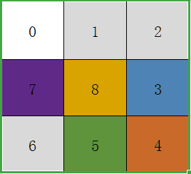

# 九宫格抽奖逻辑梳理

### 页面布局

-   默认九宫格图                                                                        
    

-   九宫格占位图
    

### HTML 页面代码

```html title="代码示例"
<!-- center为九宫格区域 -->
<div class="center">
	<!-- box为九个格子，DOM拼接区域 -->
	<ul id="box">
		<!-- li中下标从0开始，0-8共九个格子 -->
		<li class="prize jp-0 active">
			<!-- 动态获取奖品图标和文字描述 -->
			
			<p>xxxx</p>
		</li>
		<li>1</li>
		<li>2</li>
		<li>3</li>
		<!-- 其中下标为4的格子是最中心的按钮 -->
		<li class="no-price" id="drawBtn">
			<div>开始抽奖</div>
		</li>
		<li>5</li>
		<li>6</li>
		<li>7</li>
		<li>8</li>
	</ul>
</div>
```

### 页面样式

九宫格布局相关 CSS 页面样式

```css title="代码示例"
.center ul {
	box-sizing: border-box;
	padding: 15px;
	width: 100%;
	height: 100%;
}

ul li {
	float: left;
	box-sizing: border-box;
	width: 195px;
	height: 195px;
	background: #fff;
	border-radius: 6px;
	text-align: center;
}

ul li:nth-child(2),
ul li:nth-child(8) {
	margin: 0 15px;
}

ul li:nth-child(4),
ul li:nth-child(6) {
	margin: 15px 0;
}

ul li:nth-child(5) {
	cursor: pointer;
	margin: 15px;
	background: #f86f05;
}

ul li:nth-child(5):hover {
	opacity: 0.8;
}

ul li > img {
	margin-top: 20px;
	width: 104px;
	height: 104px;
}

ul li > p {
	line-height: 40px;
	font-size: 28px;
	color: #ff9f00;
}

ul li.no-price {
	padding: 15px 0;
}

ul li.no-price div {
	padding: 10px 16px;
	line-height: 60px;
	font-size: 54px;
	color: #fff;
	letter-spacing: 2px;
}

ul li.no-price p.tips {
	line-height: 30px;
	font-size: 16px;
	color: #fff;
	font-weight: bold;
	text-align: center;
}

#box li.active {
	background: #fcff76;
}
```

### 代码逻辑

Luck 幸运抽奖函数方法：

```javascript title="代码示例"
// 抽奖动画效果
var luck = {
	index: -1, //当前转动到哪,起点位置
	count: 0, //共有多少个位置
	timer: 0, //setTimeout的ID,用clearTimeout清除
	speed: 20, //初始化转动速度
	times: 0, //转动次数
	cycle: 25, //转动基本次数:即转动多少次之后进入抽奖环节
	prize: -1, //中奖位置
	init: function (id) {
		if ($("#" + id).find(".prize").length > 0) {
			$luck = $("#" + id);
			$units = $luck.find(".prize");
			this.obj = $luck;
			this.count = $units.length;
			$luck.find(".jp-" + this.index).addClass("active");
		}
	},
	roll: function () {
		var index = this.index;
		var count = this.count;
		var luck = this.obj;
		$(luck)
			.find(".jp-" + index)
			.removeClass("active");
		index += 1;
		if (index > count - 1) index = 0;
		$(luck)
			.find(".jp-" + index)
			.addClass("active");
		this.index = index;
		return false;
	},
	stop: function (index) {
		this.prize = index;
		return false;
	}
};
```

奖品列表 DOM 拼接：

```javascript title="代码示例"
/* 奖品列表排序 */
let sortList = function (data, el) {
	var str = "",
		sortArr = [];
	for (let i = 0, len = data.length; i < len; i++) {
		let tmp = data[i];
		if (i == 3) {
			sortArr[i] = `<li class="prize jp-7" data-gid="${tmp.goodGid}"><p>${tmp.name}</p></li>`;
		} else if (i == 4) {
			sortArr[i] = `<li class="no-price" id="drawBtn"><div>开始抽奖</div><p class="tips">注：奖品以最终实物为准</p></li>`;
			sortArr[5] = `<li class="prize jp-3" data-gid="${tmp.goodGid}"><p>${tmp.name}</p></li>`;
		} else if (i == 5) {
			sortArr[6] = `<li class="prize jp-6" data-gid="${tmp.goodGid}"><p>${tmp.name}</p></li>`;
		} else if (i == 6) {
			sortArr[7] = `<li class="prize jp-5" data-gid="${tmp.goodGid}"><p>${tmp.name}</p></li>`;
		} else if (i == 7) {
			sortArr[8] = `<li class="prize jp-4" data-gid="${tmp.goodGid}"><p>${tmp.name}</p></li>`;
		} else {
			sortArr[
				i
			] = `<li class="prize jp-${i}" data-gid="${tmp.goodGid}"><p>${tmp.name}</p></li>`;
		}
	}
	$("#" + el).html(sortArr.join(""));
	// 在拼接完页面之后再初始化抽奖逻辑函数，否则获取不到li的DOM节点列表
	luck.init("box");
};
```

时间、速度、中奖编号&中奖奖品下标控制：

```javascript title="代码示例"
/* 时间、速度、中奖编号控制 */
function roll() {
	luck.times += 1;
	luck.roll();
	if (luck.times > luck.cycle + 10 && luck.prize == luck.index) {
		clearTimeout(luck.timer);
		luck.prize = -1;
		luck.times = 0;
		click = false;
	} else {
		if (luck.times < luck.cycle) {
			luck.speed -= 20;
		} else if (luck.times == luck.cycle) {
			// 奖品位置下标
			if (prizeInfo.index != "") {
				luck.prize = prizeInfo.index;
			}
		} else {
			if (luck.times > luck.cycle + 10 && ((luck.prize == 0 && luck.index == 7) || luck.prize == luck.index + 1)) {
				luck.speed += 110;
			} else {
				luck.speed += 20;
			}
		}
		if (luck.speed < 40) luck.speed = 40;
		luck.timer = setTimeout(roll, luck.speed);
	}
	return false;
}
// 初始化点击事件为false，防止多次点击造成动画累积
var click = false;
```

点击抽奖实现：

```javascript title="代码示例"
/* 点击抽奖 */
$("#box").on("click", "li#drawBtn", function () {
	if (click) {
		return false;
	} else {
		$.post(`api`, { genre: 3, type: 2 }, function (res) {
			if (res.code == 1) {
				let data = res.result_data;
				let gId = data.goodGid,
					pIndex = "";
				$("#prizeImg").attr("src", data.pic);
				$("#prizeTips").html(data.name);
				let arr = prizeList;
				for (let i = 0, len = arr.length; i < len; i++) {
					let goodGid = arr[i]["goodGid"];
					if (gId == goodGid) {
						switch (i) {
							case 3:
								prizeInfo.index = 7;
								break;
							case 4:
								prizeInfo.index = 3;
								break;
							case 5:
								prizeInfo.index = 6;
								break;
							case 6:
								prizeInfo.index = 5;
								break;
							case 7:
								prizeInfo.index = 4;
								break;
							default:
								prizeInfo.index = i;
								break;
						}
						break;
					}
				}
				// 抽奖
				luck.speed = 100;
				roll();
				click = true;
				let timer = setTimeout(function () {
					clearTimeout(timer);
					$("#mask").fadeIn();
				}, 4000);
				return false;
			} else {
				alert(res.message);
			}
		});
	}
});
```
